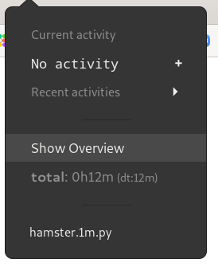

# Hamster plugin for Argos

[Argos](https://github.com/p-e-w/argos) extension that works with [Hamster 
time tracker](https://github.com/projecthamster/hamster)

# Installation
`make` will copy the plugin in ~/.config/argos

# Configuring
Check the beginning of the file and tweak to your taste
